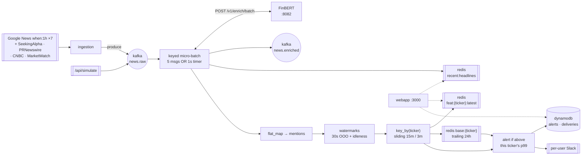

# RiskRadar

Multi-user financial risk monitor. Sign up, pick from the Magnificent 7, connect
Slack, and get alerted when negative news pushes a company outside **its own**
normal range.

Live news → Kafka → PyFlink sliding windows → FinBERT sentiment → per-ticker
adaptive alerting → Slack. All Python, one `docker compose up`.



## Quick start

```bash
cp .env.example .env          # set SECRET_KEY; nothing else is required
make demo                     # build, start, wait for the Flink job
```

Then open **http://localhost:3000**, create an account, pick tickers, and
optionally paste a [Slack incoming webhook](https://api.slack.com/messaging/webhooks).

| Port | What |
|---|---|
| 3000 | web app |
| 8081 | Flink UI — the job should read **RUNNING** |
| 8090 | Kafka UI — `news.raw`, `news.enriched` |
| 8082 | enrichment service (`/stats` shows the live sentiment tier) |
| 8000 | dynamodb-local |

No API keys anywhere. Every news source is free and keyless.

```bash
make test        # 186 tests, no containers needed
make calibrate   # replay real news, report what alerting would do
make seed        # populate per-ticker baselines from the last 24h
make simulate    # force a synthetic event for TSLA
```

## Why there is no threshold constant

The obvious design is `if risk > 0.7: alert`. It does not work, and the failure
is measurable rather than theoretical.

Replaying **672 real Mag 7 headlines** over 6 hours through the risk formula:

| approach | windows firing | alerts |
|---|---|---|
| fixed threshold 0.7 | **202 / 1499 (13.5%)** | 1.4 per ticker per **hour** |
| mean-sentiment variants, any window 5–60m | 0 / 488 (0.0%) | none, ever |

The fixed cut fires constantly because `sentiment_risk = (1 − s) / 2` maps
*perfectly neutral* news to 0.5 — already most of the way to 0.7 — so a single
mildly negative headline (n=1, sentiment −0.30) scores **0.8125** and alerts.
Swing the other way and average the sentiment instead, and nothing ever fires,
because real news mixes good and bad and the mean sits near zero at every window
size.

There is no constant that sits robustly between 13.5% and 0.0%, because the
right cut depends on the sentiment model, the feed mix, and the ticker.

**So each ticker is judged against its own trailing 24 hours.** A window alerts
when it lands in that ticker's top 1%. TSLA sees ~11 articles an hour and AAPL
~32; they get different bars automatically, and the rate stays stable when the
model or the feeds change. `tools/calibrate.py` replays a live corpus and reports
the resulting rate so the percentile is tuned against data, not taste:

```
     p  crossings  alerts  per ticker/day
    90         47      21           11.16
    95         37      16            8.50
    99         11       7            3.72
  99.5         10       6            3.19
```

Two consequences worth knowing:

- **Cold start is seeded, not waited out.** 50 samples at a 3-minute slide is
  2.5h of warmup, and the natural fallback during warmup is the same 0.7 that
  fires 13.5% of the time — so a fresh `make demo` would spam alerts for exactly
  the hours you're watching. `tools/seed_baseline.py` replays the last 24h at
  startup; until a ticker has enough samples, alerting stays **silent**.
- **A sustained spike self-damps.** Firing windows feed the distribution, so a
  prolonged crisis raises the ticker's own bar and quiets down. That is intended
  for anomaly detection, but it means this reports the *onset* of bad news, not
  its persistence.

## Why these news sources

Picked by measurement, not reputation. Probed live on 2026-07-27:

| source | fresh items | verdict |
|---|---|---|
| **Google News `when:1h`** ×7 tickers | **157 in the last hour**, all ≤60 min | primary |
| Seeking Alpha market currents | 7, all ≤1h | secondary |
| PR Newswire financial | 20, of which 17 ≤1h | secondary |
| CNBC / MarketWatch | 30 / 10, newest 5.7h / 1.0h | breadth |
| Yahoo Finance per-ticker | **HTTP 429** under a 7-ticker loop | backup only |

Yahoo is the obvious pick and it throttles. Google News' `when:` operator is what
makes freshness free — constraining the query to the last hour means nearly
everything arriving is genuinely new. Age filtering still runs first, because
CNBC's evergreen tail reaches **914 hours** old and the timestamp-clamping step
would otherwise re-inject month-old articles as breaking news forever.

## Why FinBERT and not a general sentiment model

Scoring the same corpus with plain VADER, the most "negative" headlines were:

```
-0.91  Silicon Valley developer accused of murder after ... Tesla ...
-0.90  Fake song appears on jailed rapper's Apple Music profile ...
```

Maximal lexical negativity, near-zero *financial* risk. A finance-tuned model
scores these near neutral. The service degrades FinBERT → FinVADER → VADER if
torch is unavailable, and `/stats` reports which tier is live.

## Notes from the build

Real data kept correcting the design:

- **"Get Ready for the Gravenstein Apple Fair in Sebastopol" matched AAPL.** A
  fruit festival. The first fix — requiring a finance keyword nearby — dropped 35
  articles to fix 1, killing obvious hits like "Apple Reclaims Title as World's
  Most Valuable Company". Inverting it to reject only the stereotyped
  non-corporate senses (fruit, rainforest, meta-analysis) removes exactly 1 of 177.
- **The window widened from 5m to 15m.** At the measured ~16 articles per ticker
  per hour, a 5-minute window holds a median of *two* articles — too thin for any
  volume signal to mean anything.
- **Identical baseline observations silently collapsed.** Redis sorted-set members
  are a set, so two windows with the same `(timestamp, score)` became one entry,
  under-counting the distribution and suppressing alerting indefinitely.

## Layout

```
libs/core/riskcore/     shared domain logic — imported by every service AND the Flink job
  risk.py               window scoring (the displayed 0-1 gauge)
  baseline.py           per-ticker adaptive alert cut
  entities.py           Mag 7 matching, ambiguity guard
  feeds.py              source definitions + parsing
  windows.py            Flink's sliding-window assignment, reimplemented for replay
services/enrichment/    FastAPI + FinBERT, :8082
services/ingestion/     poll → filter → dedup → clamp → produce
services/webapp/        auth, dashboard, API, :3000
flink/job/news_job.py   the streaming topology
tools/                  calibrate.py · seed_baseline.py · replay.py
tests/                  186 tests, container-free
deploy/aws/             EC2 user-data, Caddy, IAM policy
```

`riskcore` is a real installable package rather than copied source, so the
calibration harness buckets windows with the *same* code the running job uses —
a calibration number computed by different code than the job would be worse than
no number.

## Deployment

`deploy/aws/NOTES.md`. Single **x86_64 t3.xlarge** (~$121/mo) running the same
compose file. PyFlink has no arm64 wheel at any version, so Graviton is off the
table. The only local↔prod difference is `DYNAMO_ENDPOINT_URL`: set it and boto3
talks to dynamodb-local, unset it and boto3 uses the instance role.

## Status

Phases 0–8 complete: infra, shared library, enrichment, ingestion, the Flink job,
the webapp, simulate, tooling, and deploy scripts.

Verified here: 186 tests pass; the Flink job graph builds against a real
PyFlink 1.20.1 runtime; the ingestion path fetches and matches live articles;
the calibration harness runs end-to-end on real news.

Not yet verified: the full compose stack has never been started — this
environment has no Docker daemon — and the AWS scripts have not been executed.
The riskiest unexercised path is the micro-batch operator's blocking HTTP call
inside a processing-time timer, which is proven to construct but not to run
under load.
