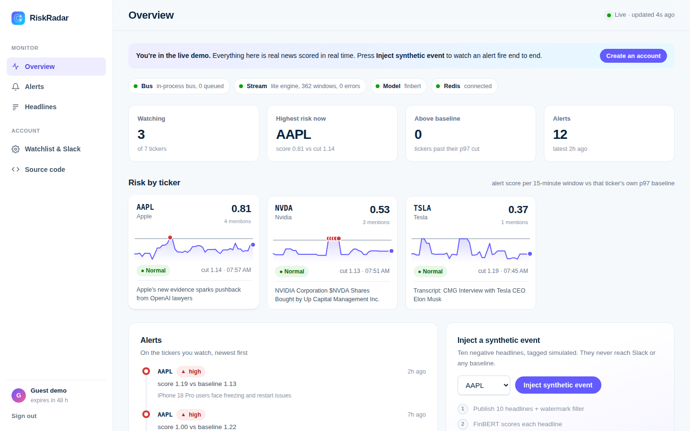
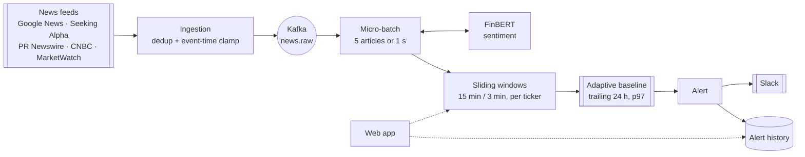

# RiskRadar

**Real-time financial news risk monitoring for the Magnificent 7.**

### [▶ Try the live demo](https://risk-radar.20.25.227.252.sslip.io)

One click, no sign-up. You land on a live dashboard streaming real market news.


RiskRadar reads financial headlines as they break, scores each one with
**FinBERT**, a finance-tuned language model, and alerts you the moment a company
moves outside **its own** normal range. It doesn't use a fixed threshold that
fires on noise. Instead, every ticker gets an adaptive baseline learned from its
own trailing 24 hours.



## Highlights

- **Streaming pipeline.** Kafka → Apache Flink → FinBERT → Redis → PostgreSQL,
  with event-time sliding windows (15 min, sliding every 3) and
  bounded-out-of-orderness watermarks.
- **Adaptive per-ticker alerting.** Each company is judged against the p97 of
  its own trailing distribution, so TSLA (≈11 articles/hour) and AAPL (≈32/hour)
  each get the right bar automatically.
- **Two interchangeable stream engines.** The full PyFlink topology on a
  cluster, or the identical topology in one lightweight Python process. Both
  share a single stage module, so outcomes are identical.
- **Relational data model.** PostgreSQL with foreign keys, cascading deletes,
  a unique email constraint, and indexes shaped to every query: a user's alert
  history with delivery status is a single join.
- **Built for the open internet.** Rate limiting, CSRF protection, a strict
  Content Security Policy, sandboxed systemd deployment, and one-click guest
  accounts.
- **Polished product UI.** A live dashboard with interactive charts, an alert
  timeline, and a one-button crisis simulator that tracks an event through
  every pipeline stage.

## How to use it

1. Open the **[live demo](https://risk-radar.20.25.227.252.sslip.io)** and click
   **Try the live demo**.
2. Watch **Risk by ticker**: each card plots the alert score of every 15-minute
   window against that ticker's own baseline. Red points crossed it.
3. Press **Inject synthetic event**. Ten negative headlines flow through
   FinBERT, close a window, and fire an alert in about 2 seconds. The four-step
   tracker lights up as each stage completes.
4. Create an account to choose your own tickers and receive alerts in Slack.

### Run it locally

```bash
cp .env.example .env        # set SECRET_KEY
make demo                   # full stack: Kafka + Flink + FinBERT + Redis + PostgreSQL
make demo-lite              # same pipeline without Flink (~60 MB stream engine)
```

Then open http://localhost:3000.

```bash
make test                   # 366 tests
make calibrate              # replay real news and report the alert rate
```

## Architecture



| Layer | Technology |
|---|---|
| Streaming | Apache Kafka, Apache Flink (PyFlink), event-time windows and watermarks |
| NLP | FinBERT (ProsusAI), batched CPU inference |
| Data | PostgreSQL 16 (users, watchlists, alert history, deliveries) via SQLAlchemy; Redis (baselines, live features, rate limits) |
| Web | FastAPI, vanilla JS, hand-built SVG charts |
| Deploy | Docker Compose, or a hardened single-node systemd service behind Caddy |

## Validation and benchmarks

### Why an adaptive baseline

Replaying **672 real Mag 7 headlines** through the risk model showed that no fixed
threshold works:

| Alerting approach | Windows that fire |
|---|---|
| Fixed 0.7 threshold | **13.5%** (a single mildly negative headline scores 0.81) |
| Average sentiment | **0%** (good and bad news cancel out) |
| **Per-ticker p97 baseline** | **~1.07 alerts per ticker per day** |

The p97 setting comes from a FinBERT calibration over **653 articles and 789
windows**, which landed inside the 1-3 alerts per ticker per day target.

### Performance

| Metric | Result |
|---|---|
| Headline to alert, lightweight engine | **~0.4 s** |
| Headline to alert, Apache Flink | **~3.5 s** |
| Simulated crisis to alert, live dashboard | **~2.4 s** |
| FinBERT batch inference (5 headlines) | **~88 ms** |
| Stream engine memory, Flink vs lightweight | **~960 MB vs ~62 MB** |
| Full single-node deployment (web + pipeline + FinBERT) | **~0.8 GB** |
| Ingestion throughput | **160-190 articles per 2-minute sweep** |

### Quality and security

- **366 automated tests**, covering event-time windowing semantics, baseline
  statistics, alert policy, abuse limits, the PostgreSQL data layer and its
  migration tooling, all run against a real PostgreSQL.
- **End-to-end verification** of both stream engines in Docker, with simulated
  and organic alerts firing on live news.
- **Independent security review** of the public deployment: rate limiting,
  CSRF, CSP, SSRF-safe Slack webhooks, XSS-safe feed handling, and a systemd
  sandbox that scores **3.0 ("OK")** on `systemd-analyze security`.

## Project layout

```
libs/core/riskcore/   shared domain logic: scoring, windows, baselines, alerting
flink/job/            Apache Flink streaming topology
services/processor/   lightweight stream engine (same topology, plain Python)
services/enrichment/  FinBERT sentiment service
services/ingestion/   feed polling, dedup, event-time clamping
services/webapp/      FastAPI app, dashboard, public API
services/standalone/  single-process deployment for small servers
deploy/               Azure (systemd + Caddy) and AWS deployment
tests/                366 tests
```

---

Built by [Rishi Manimaran](https://github.com/rishimj).
