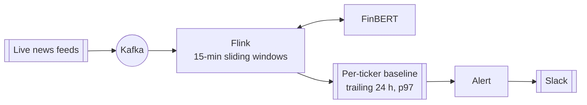

# RiskRadar

**Real-time financial news risk monitoring for the Magnificent 7.**

### [▶ Try the live demo](https://risk-radar.20.25.227.252.sslip.io)

One click, no sign-up.


RiskRadar streams breaking financial headlines through Kafka and Apache Flink,
scores them with **FinBERT**, and alerts you on Slack the moment a company moves
outside **its own** normal range. Every ticker gets an adaptive baseline learned
from its trailing 24 hours, so alerts stay rare and meaningful.

**Stack:** Kafka · Apache Flink (PyFlink) · FinBERT · Redis · DynamoDB · FastAPI · Docker · systemd + Caddy on Azure

## How to use it

1. Open the **[live demo](https://risk-radar.20.25.227.252.sslip.io)** and click **Try the live demo**.
2. Watch **Risk by ticker**: each card plots every 15-minute window against that ticker's own baseline.
3. Press **Inject synthetic event**. Ten negative headlines flow through FinBERT
   and fire an alert in about 2 seconds, with each pipeline stage lighting up as it completes.
4. Create an account to pick your tickers and get alerts in Slack.

Run it locally:

```bash
cp .env.example .env   # set SECRET_KEY
make demo              # Kafka + Flink + FinBERT + Redis + DynamoDB
make test              # 346 tests
```

## How it works



## Validation and benchmarks

**Alert quality.** Replaying 672 real Mag 7 headlines showed that fixed thresholds
fail in both directions, so I calibrated an adaptive baseline on 653 articles and
789 windows:

| Approach | Result |
|---|---|
| Fixed 0.7 threshold | 13.5% of windows fire (noise) |
| Average sentiment | 0% fire (signal lost) |
| **Per-ticker p97 baseline** | **~1 alert per ticker per day** |

**Performance.**

| Metric | Result |
|---|---|
| Headline to alert (Flink) | **~3.5 s** |
| Headline to alert (lightweight engine) | **~0.4 s** |
| FinBERT batch inference (5 headlines) | **~88 ms** |
| Stream engine memory, Flink vs lightweight | **960 MB → 62 MB** |
| Full production node (web + pipeline + FinBERT) | **~0.8 GB** |
| Ingestion throughput | **160-190 articles per 2-minute sweep** |

**Engineering.**

- **346 automated tests** covering event-time windowing, watermarks, baseline statistics, alert policy and security.
- **End-to-end verified** on live news with both stream engines.
- **Hardened for the public internet:** rate limiting, CSRF, strict CSP, SSRF-safe
  webhooks, and a sandboxed systemd service rated "OK" by `systemd-analyze security`.

---

Built by [Rishi Manimaran](https://github.com/rishimj).
